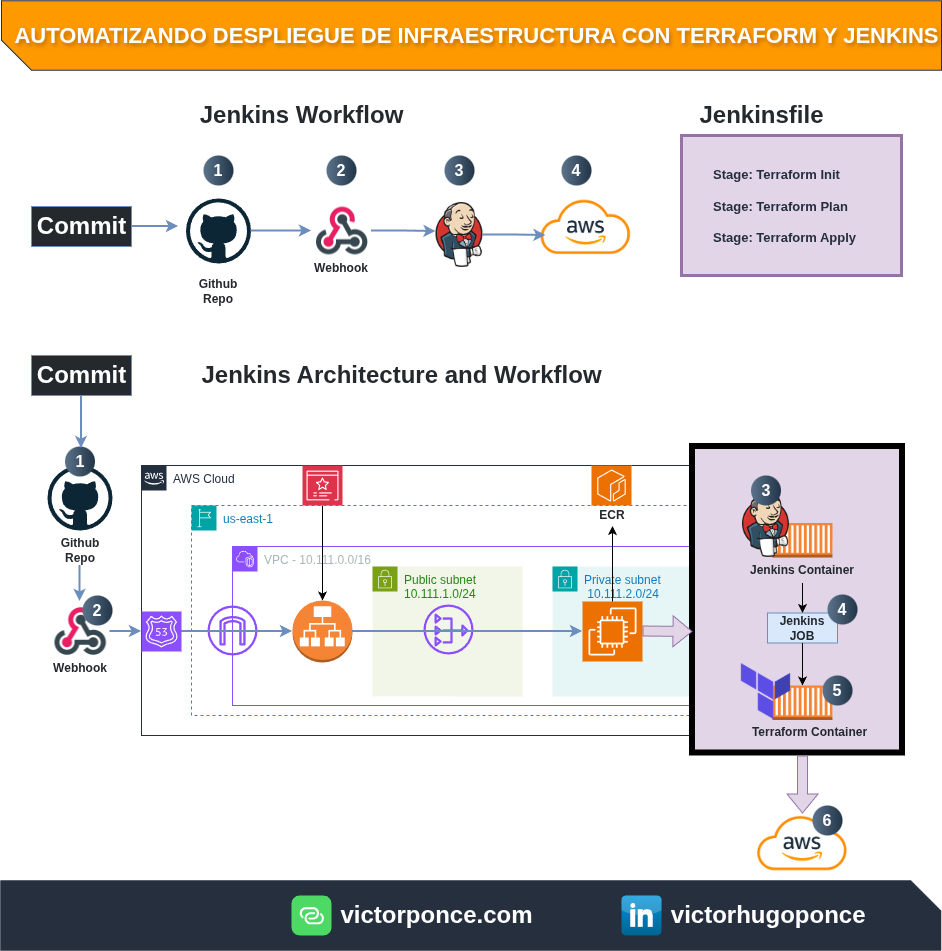
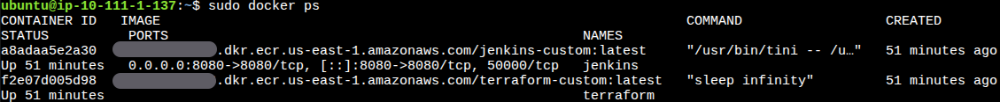
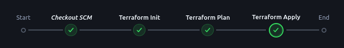

# Project: Automating cloud infrastructure deployment with Terraform and Jenkins

**Author:** Victor Ponce | **Contact:** [Linkedin](https://www.linkedin.com/in/victorhugoponce) | **Website:** [victorponce.com](https://victorponce.com)

🇪🇸 **Versión en Español:** [README.es.md](https://github.com/victorhponcec/article-aws-devops-jenkins-prowler-ecr/blob/main/README.es.md)

**Notes:** *The code for this project is in a private repository. Feel free to contact me if you want to access it.* 

## 1. General Description

In this project, I designed an architecture in AWS to support an ecosystem in charge of automated cloud infrastructure deployment, compatible with AWS, Azure, and GCP.

## 2. Architecture

**(img. 1 – Jenkins environment architecture)**

### Main Components:

**EC2 Instance:** runs a Jenkins container and another container with Terraform.

**(img. 2 – Jenkins and Terraform containers running on EC2 host)**

**ECR:** stores the previously built Docker images for Jenkins and Terraform, which are used to spin up both containers.

**Docker Compose:** handles the orchestration and management of the containers.

**ALB:** the Application Load Balancer directs encrypted requests toward the EC2 instance.

**Route 53:** a unique domain is used to expose Jenkins.

**GitHub:** repository for the Terraform code.

**Jenkins:** an open-source automation and CI/CD tool that allows us to create, test, and deploy infrastructure as code and software automatically through pipelines. In this project, it integrates with Docker to interact with Terraform via a container and generate infrastructure in AWS.

**Terraform:** an Infrastructure as Code (IaC) tool that allows defining, provisioning, and managing infrastructure in a declarative and automated way.

## 3. Automated Flow:

1. The flow begins with a commit to the main branch.

2. A webhook is triggered, notifying Jenkins.

3. Jenkins executes a Job that runs a pipeline with the commands `terraform init` and `terraform plan`.

**(img. 3 – Jenkins Pipeline (init/plan))**

4. If the Job finishes without errors, the Job is executed again, this time adding `terraform apply`, which deploys the infrastructure in AWS.

**(img. 4 – Jenkins Pipeline (apply))**

## 4. Security:

**Security Groups:** allow ingress only from known IPs.

**ALB with ACM:** traffic between the DevOps team and the Jenkins environment is encrypted.

**Private Subnet:** computation is executed within a private subnet.

**AWS Systems Manager Session Manager:** Access to the EC2 instance using temporary AWS credentials, without SSH.

## 5. Benefits:

Running Jenkins on your own infrastructure allows for total control over the CI/CD flow, as well as virtually unlimited automation options, unlike managed solutions such as GitHub Actions or Terraform Cloud.

## 6. Disadvantages:

**Costs:** the infrastructure necessary to operate Jenkins securely can be more expensive than other alternatives. However, this difference is justified when the workload volume is higher.

**Technical Requirements:** a good knowledge of Jenkins, containers, networking, and security is required, as all administration falls into our hands.

## 7. Conclusions:

This project took me more time than I had anticipated. During the design phase, I realized I would need to use containers to generate an immutable working architecture, capable of being spun up again in minutes in case of failures or environment corruption.

I encountered several errors that made me realize CloudFront was not a good option for this type of architecture. Generating the EC2 user data script was also a separate challenge; everything had to be executed precisely while considering the requirements for Docker, Jenkins, Terraform, routes, and permissions, among others, so the environment would start without errors and avoid manual adjustments after deployment.

Once the environment was provisioned, creating the automation was a trivial task. At this stage, any infrastructure deployment can be automated in a matter of minutes. It simply requires generating a Jenkins Job that responds to the GitHub Webhook when a commit occurs in the specified branch. The job will work based on the logic of the Jenkinsfile configured in the repository.

Finally, the presented project meets the automation, security, and stability objectives necessary for a productive DevOps environment.